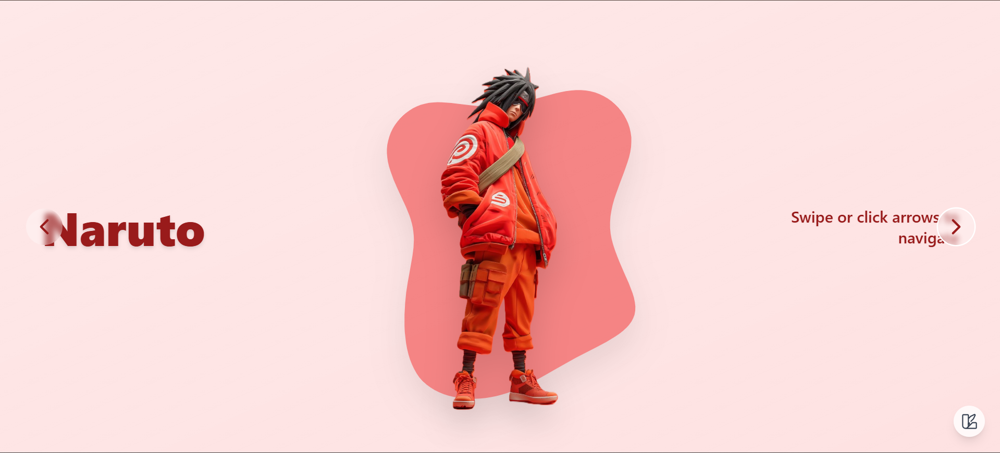
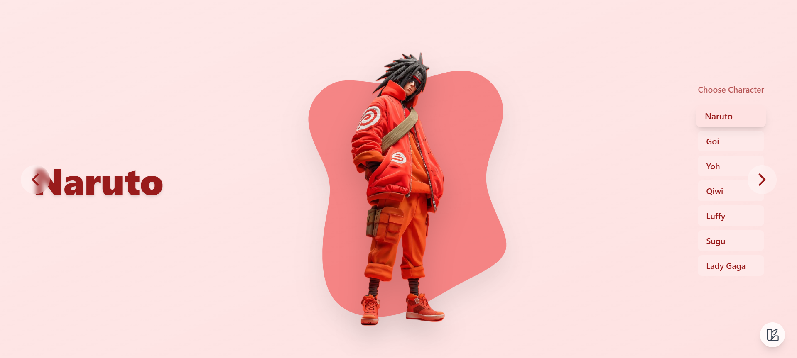

## Run Locally

**Prerequisites:**  Node.js

1. Install dependencies:
   `npm install`
2. Set the `GEMINI_API_KEY` in [.env.local](.env.local) to your Gemini API key
3. Run the app:
   `npm run dev`

## GSAP Animated Blob Carousel

This is an interactive carousel application built with React and GSAP (GreenSock Animation Platform). The app features animated blob-shaped cards that transition smoothly when navigating between different characters.

### Features

- Smooth 3D flip animations using GSAP
- Responsive design that works on different screen sizes
- Interactive navigation with next/previous buttons
- Touch swipe support for mobile devices
- Color customization options
- Character selection panel

### Tech Stack

- React 19.2.0
- GSAP 3.13.0
- TypeScript
- Tailwind CSS (implied from class usage)
- Vite (bundling and development server)

### Project Structure

The application consists of several key components:

- `App.tsx` - Main application component with animation logic
- `constants.ts` - Contains character data and configuration
- `components/BlobCard.tsx` - Renders the animated blob cards with character images
- `components/BackgroundBlobs.tsx` - Handles background animations
- `components/CharacterSelector.tsx` - Provides character selection interface
- `components/ColorPicker.tsx` - Allows color customization
- `components/Navigation.tsx` - Handles navigation controls
- `hooks/useSwipe.ts` - Implements swipe gesture functionality

### How It Works

The carousel displays different characters (Naruto, Goi, Yoh, Qiwi, Luffy, Sugu, Lady Gaga) with each having:

- A unique blob shape (SVG path)
- Custom colors
- Character image
- Background gradient

When navigating between characters, GSAP animations create a 3D flip effect with elastic easing for smooth transitions. The background also changes to match the selected character's color scheme.

## Images in Public Folder

# animated-character-GSAP
